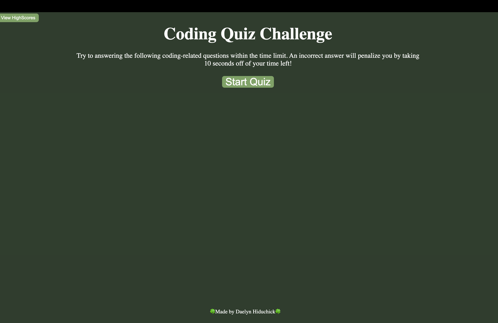
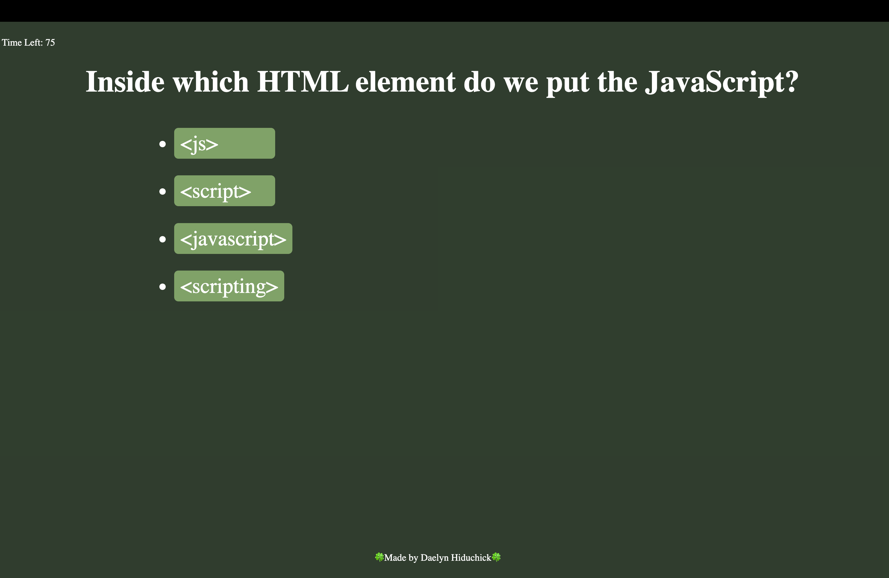
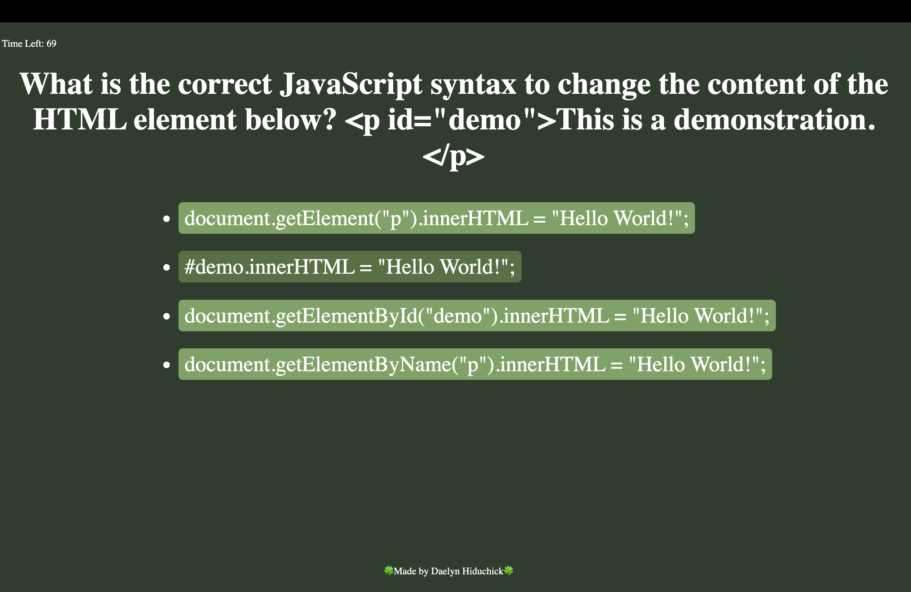
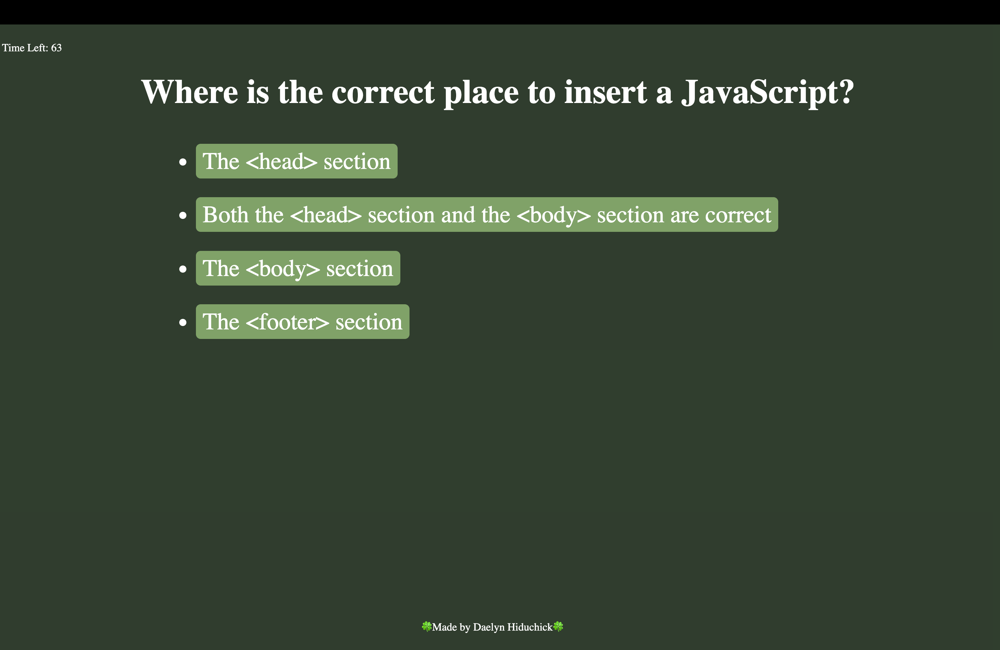
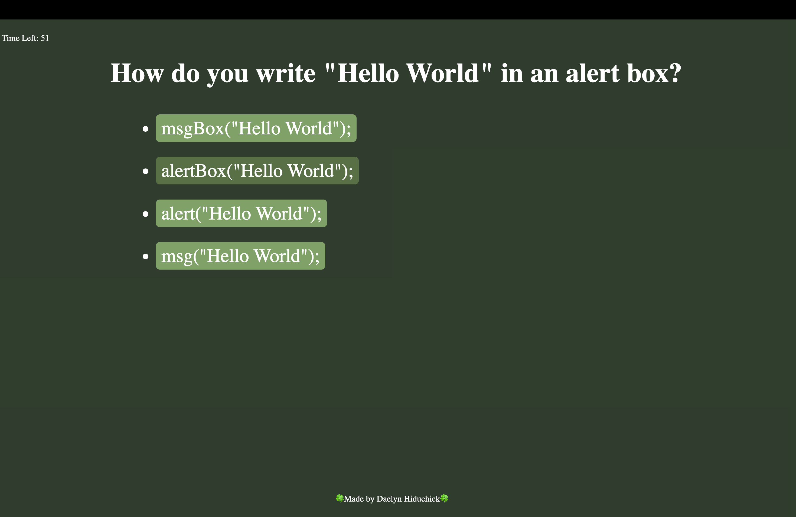
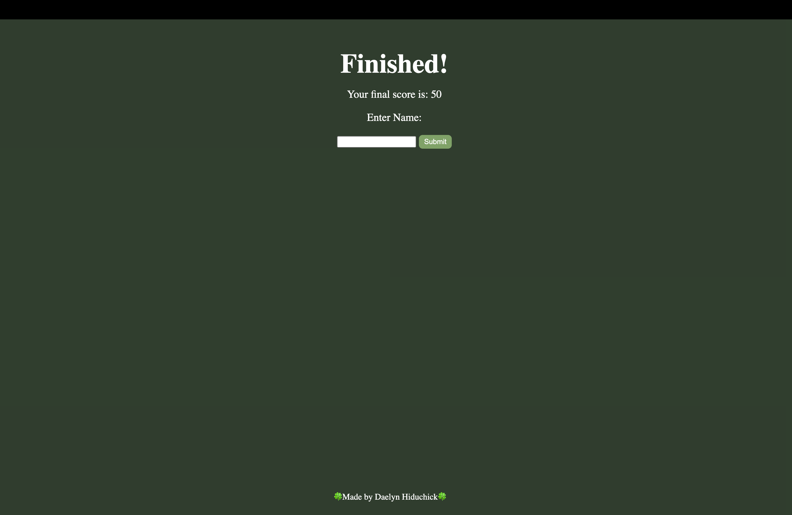
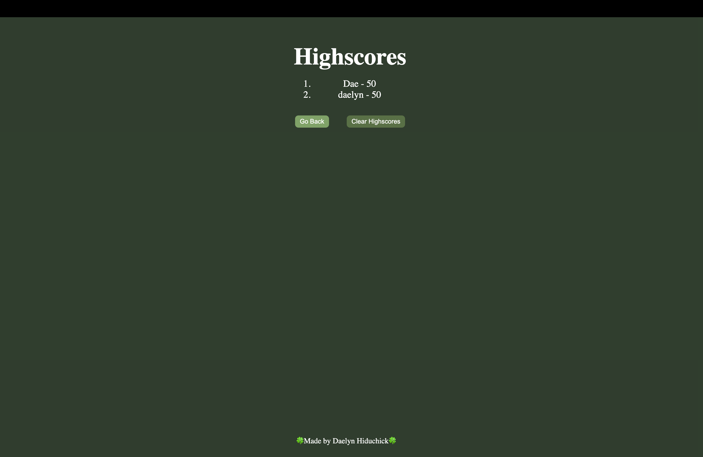

# Hiduchick-Coding-Quiz

## Description
The motivation behind this project was to create a workspace where users can test themselves or brush up on knowledge about coding basics. Once the user clicks the "Start Quiz" button, the quiz will start and a 75 second timer will begin. Each question the user selects correctly will a-lot them ten points. An incorrect selection will penalize the user, in turn decrementing their total time by ten seconds. Once the user completes the quiz, they will be asked to an input their name. The user with the highest scores name will be displayed on the "High Score" page, and the user will have the option of restarting the quiz. Through this process I have learned by direct application how much simpler jQuery can make the lives of developers, and how difficult it is to refactor jQuery code back into vanilla JavaScript as well as how important the order of operations is when calling certain functions, overall code cleanliness, and organization.

## Usage
1. Open the coding quiz URL in your browser.
2. Complete the quiz using the 'start' button and answering the questions within the time allowed. 

## Rules 
You have 75 seconds to correctly answer 5 questions...

Sounds easy enough, BUT, if you answer incorrectly you are penalized 10 seconds.

Points are awarded for correctness (10 points if you get the question correct) and at the end you can save your [local] score with your initials to the high-score board.

Just hit the start button to begin the coding quiz.

## Installation

1. Clone the repo
   git clone //!

2. Open in VS Code. If you do not have VS code you must install it.

## Built With
* HTML
* CSS
* JavaScript

## Website
//!

## Demo 

## Images 

# Author 
Daelyn Hiduchick